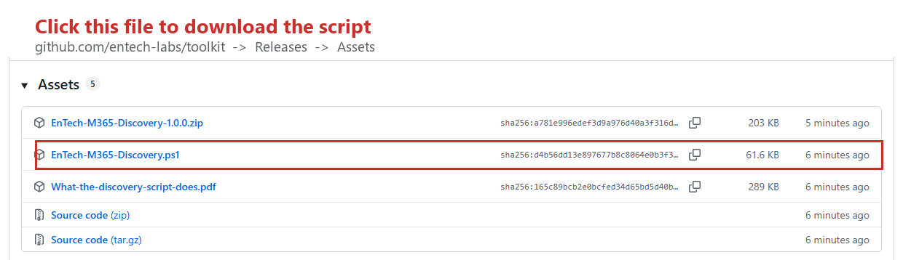
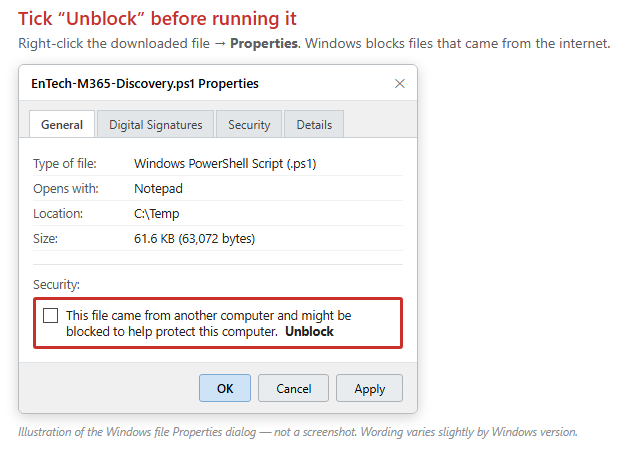
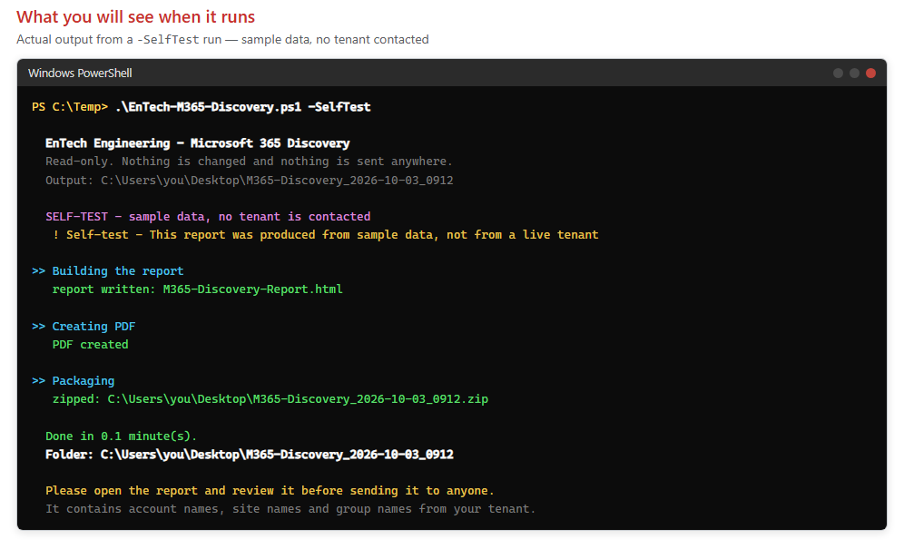

# Microsoft 365 tenant discovery

Reads a Microsoft 365 tenant and produces a report describing its size and shape, so a migration
estimate rests on measured figures rather than assumptions.

### ⬇️ [Download the script](https://github.com/entech-labs/toolkit/releases/latest/download/EnTech-M365-Discovery.ps1)

<sub>Or get everything — script, documentation and README — as
[one zip](https://github.com/entech-labs/toolkit/releases/latest/download/EnTech-M365-Discovery-1.0.0.zip)
· [all releases](https://github.com/entech-labs/toolkit/releases/latest)</sub>

📄 **[Full documentation (PDF)](docs/What-the-discovery-script-does.pdf)** — written for whoever
has to approve running it, not just for whoever runs it.

---

## Step by step

No prior PowerShell experience needed. The whole thing takes about ten minutes, and most of that
is the script running on its own.

### 1. Download the script

Use the download link above, or go to
[the releases page](https://github.com/entech-labs/toolkit/releases/latest) and click the
`.ps1` file under **Assets**:



It lands in your **Downloads** folder.

### 2. Move it somewhere simple

Create a folder called `C:\Temp` if you do not have one, and move the file into it. This is only
to keep the commands below short — anywhere will do, as long as you know the path.

### 3. Unblock it

Windows blocks files that came from the internet, and will refuse to run them. **Right-click the
file → Properties**, tick **Unblock** at the bottom, then **OK**:



If you do not see an Unblock box, the file is already unblocked. Carry on.

### 4. Open PowerShell

Press the **Windows key**, type `powershell`, and click **Windows PowerShell**.

A blue or black window opens. You do **not** need to "Run as administrator" — your Microsoft 365
account provides the access, not your Windows account.

### 5. Try it on sample data first

Copy and paste these two lines, pressing Enter after each:

```powershell
cd C:\Temp
.\EnTech-M365-Discovery.ps1 -SelfTest
```

This builds a complete example report from **obviously fictional sample data**. It contacts no
tenant, asks for no sign-in, and needs no permission. You will see roughly this:



A report opens when it finishes. That is exactly what the real one will look like, with your
figures instead of the samples.

> If you get a red error saying *"running scripts is disabled on this system"*, paste this and
> try again. It allows scripts in this one window only and reverts when you close it:
> ```powershell
> Set-ExecutionPolicy -Scope Process -ExecutionPolicy Bypass
> ```

### 6. Run it for real

```powershell
.\EnTech-M365-Discovery.ps1
```

Three things happen:

1. **It checks for two Microsoft modules** and asks before installing anything. Answer `Y`.
   They install for your user account only.
2. **A Microsoft sign-in window opens.** Sign in with an account that has **Global Reader** or
   Global Administrator. Read the permission list before approving — every item on it is a read
   permission, and the PDF explains what each one is for.
3. **It collects and writes the report**, which takes a few minutes.

### 7. Send us the report

Everything lands in a timestamped folder on your **Desktop**, with a zip of the same name beside
it:

```
M365-Discovery_2026-10-03_0912\
├── M365-Discovery-Report.pdf     ← the readable summary
├── M365-Discovery-Report.html    ← the same report, to print yourself
└── data\                         ← CSV extracts behind every figure
```

**Open the report and read it before sending it to anyone.** It contains account names, site
names and group names from your tenant. Once you are happy, the zip is what we need.

---

## What it does not do, and how to check

Every claim below can be checked by searching the script. We would rather you check than take our
word for it.

| Claim | How to verify |
|---|---|
| **Makes no change to your tenant** | Search for `Invoke-MgGraphRequest` — there are four, all `-Method GET`. Every Exchange cmdlet is a `Get-`. There is no `Set-`, `Update-` or `Disable-` cmdlet in the file |
| **Reads no message or document content** | No scope granting content access is requested. It reads counts, sizes, names and configuration only |
| **Sends nothing anywhere** | Search for `Invoke-WebRequest` and `Invoke-RestMethod` — there are none. The only outbound calls are to `graph.microsoft.com` and Exchange Online |
| **Stores no credential** | Sign-in is interactive through Microsoft's prompt; the session is disconnected at the end |
| **Only writes your own files** | `New-Item` creates the output folder, `Remove-Item` replaces a previous zip of the same name. Both local |

### Check you got the file we published

```powershell
Get-FileHash .\EnTech-M365-Discovery.ps1 -Algorithm SHA256
```

Compare the result against the SHA256 shown on the
[release page](https://github.com/entech-labs/toolkit/releases/latest). GitHub displays it beside
each file.

---

## What it reports

| Area | Why it matters for a migration |
|---|---|
| Tenant, verified domains, directory sync | A domain lives in one tenant at a time — this is what makes cutover a fixed window |
| Licensing, purchased vs assigned | Which workloads are actually entitled |
| Accounts: total, enabled, disabled, guests | Disabled and unlicensed accounts often need not move at all |
| Mailbox count, sizes, largest, archives, holds | A few large mailboxes drive the schedule more than the average |
| **Mail data split by mailbox type** | Where the data really sits — user vs shared vs rooms vs system accounts |
| OneDrive storage and file counts | File *count* matters as much as volume |
| SharePoint sites and storage | |
| **SharePoint composition** | Document libraries are copied; custom lists, pages and forms are rebuilt by hand |
| Teams, private channels, groups | Private channels each have a hidden site and migrate badly |
| Transport rules, connectors, public folders | None of these migrate — each is rebuilt |
| Applications with SSO, conditional access | The most commonly under-estimated item |

Anything it could not collect is listed in the report under **Sections that could not be
collected**, with the reason. A silently missing section would mean an estimate built on a gap
nobody knew about.

---

## Options

```powershell
.\EnTech-M365-Discovery.ps1 -SelfTest                 # sample data, nothing contacted
.\EnTech-M365-Discovery.ps1 -SkipExchange             # Graph sections only
.\EnTech-M365-Discovery.ps1 -ReportPeriod D90         # 90-day usage window (default D30)
.\EnTech-M365-Discovery.ps1 -OutputPath C:\Temp\Disc  # somewhere other than the Desktop
```

---

## If something does not work

**"Running scripts is disabled on this system."** See the note in step 5.

**Hashes instead of names in the report.** Microsoft 365 can be set to conceal user, group and
site names in reports. The script detects this and says so. Totals stay accurate; the detail
becomes unattributable until an administrator turns it off under
**Settings → Org settings → Reports**.

**No PDF was produced.** Conversion uses Microsoft Edge in headless mode. If neither Edge nor
Chrome is found, the HTML report is still there — open it and print to PDF.

**Sign-in is blocked.** Some conditional access policies block PowerShell. Run from a compliant
device, or have an administrator add a temporary exclusion. The script does not work around this,
and should not be able to.

**A section is missing.** That is reported, not hidden — see the box at the end of the report.

**Anything else** — stop and ask us before re-running. We would far rather answer a question than
have you run something you are not comfortable with.
